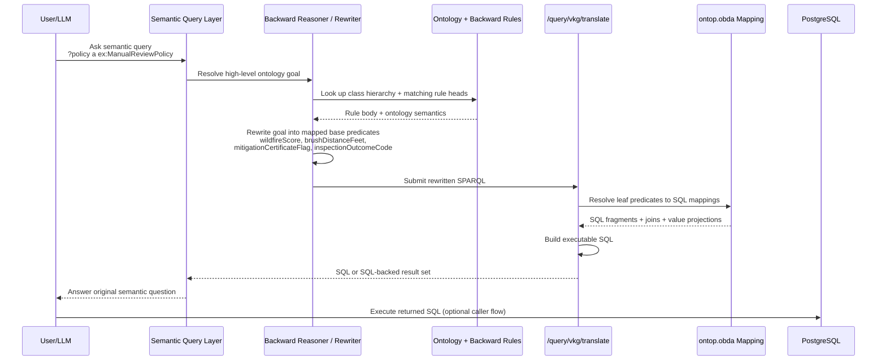

# SPARQL2SQL Ontology Mapping Advanced

Date: 2026-04-10
Audience: Engineers extending SPARQL-to-SQL with semantic reasoning
Scope: Ontological reasoning, inference rules, and advanced semantic patterns beyond direct table/property mapping

## 1. Purpose

This document is for the next level up from direct mapping.

The basic knowledge-transfer guide explains how to map:

- SQL table -> ontology class
- SQL column -> datatype property
- SQL FK/join -> object property

This document explains what becomes possible when you add:

- ontology hierarchy
- semantic abstraction over overloaded schemas
- forward and backward inference rules
- entity normalization
- derived relationships and classifications

These are the areas where semantic systems materially outperform systems that only expose raw SQL schema.

## 2. Current System Boundary

Current `insurance` SPARQL-to-SQL behavior:

- `/query/vkg/translate` is powered by Ontop + `ontology/insurance/ontop.obda`
- it does direct virtual mapping from SPARQL vocabulary to SQL
- it does not currently run ontology rules as part of SQL translation

Current `insurance` dataset status:

- `core.ttl` exists
- `ontop.obda` exists
- `bindings.ttl` exists
- no active `insurance` forward/backward rules are loaded today

Important implication:

- the current translator handles mapping
- advanced reasoning described here is architectural guidance for future extension, not a claim that all of it is already active in the `insurance` endpoint

## 3. Why Reasoning Matters

A pure SQL mapping system can answer:

- direct joins
- filters
- aggregates
- projection

But it struggles when the business meaning is not stored explicitly as rows/columns.

Reasoning helps when you need:

1. Classification
- infer that something is an `Agent` because of patterns, not because a table is named `agent`

2. Relationship derivation
- infer that a policy is “loss-affected” because claims exist through several join hops

3. Hierarchy
- query a superclass and automatically include subclasses

4. Identity resolution
- treat multiple records as the same real-world entity using `owl:sameAs`

5. Canonicalization
- expose a canonical business entity while preserving raw source records

6. Rule-based abstraction
- define domain logic once in ontology/rules instead of repeating it across many SQL queries

## 4. What a Non-Semantic System Usually Looks Like

Without ontology/reasoning, teams often end up with:

- duplicated SQL logic in many services
- ad hoc CASE/WHERE logic for business classification
- brittle joins that encode business meaning in application code
- no consistent abstraction over overloaded source tables
- poor portability when schema changes

Example:

```sql
SELECT CAST(party_identifier AS varchar) AS agent_id
FROM agreement_party_role
WHERE party_role_code = 'AG'
```

Without ontology, every consumer must remember:

- table name
- role-code convention
- identifier meaning

With ontology, the user asks for:

- `?policy in:soldByAgent ?agent`
- `?agent in:agentId ?agentId`

and the mapping/rules own the physical details.

## 5. Three Levels of Semantic Power

### 5.1 Level 1: Direct mapping

Handled today by `ontop.obda`.

Example:

- `policy.policy_number` -> `in:policyNumber`
- `claim_coverage + policy_coverage_detail` -> `in:against`

### 5.2 Level 2: Ontological abstraction

You define a cleaner business model than the SQL schema.

Example:

- SQL has one table `agreement_party_role`
- ontology exposes `Agent` and `PolicyHolder` as separate classes

This already improves query quality, even before general reasoning rules are added.

### 5.3 Level 3: Inference

You derive facts that are not explicitly stored as base rows.

Examples:

- if `Claim against PolicyCoverageDetail` and `PolicyCoverageDetail hasPolicy Policy`, infer `Claim inPolicy Policy`
- if `CommercialPolicy rdfs:subClassOf Policy`, then every commercial policy is also a policy
- if two entities are `owl:sameAs`, infer property propagation or canonical resolution

## 6. Ontological Reasoning Patterns

### 6.1 Subclass reasoning

Ontology:

```ttl
in:CommercialPolicy rdf:type owl:Class ;
  rdfs:subClassOf in:Policy .
```

Inference:

- if `?x a in:CommercialPolicy` then `?x a in:Policy`

Why SQL-only systems struggle:

- every query against `Policy` must remember to union all subtype tables or subtype conditions

Why semantic systems help:

- subclass semantics are declared once

### 6.2 Property inheritance / super-properties

Ontology:

```ttl
in:hasPrimaryAgent rdfs:subPropertyOf in:soldByAgent .
```

Inference:

- if `?p in:hasPrimaryAgent ?a`, then `?p in:soldByAgent ?a`

Why useful:

- lets applications query broad relationships while storage may distinguish subtypes

### 6.3 Property-chain reasoning

Concept:

- if `Claim against PolicyCoverageDetail`
- and `PolicyCoverageDetail hasPolicy Policy`
- infer `Claim inPolicy Policy`

Expressed as rule:

```text
[claimPolicy:
  (?claim in:against ?pcd),
  (?pcd in:hasPolicy ?policy)
  ->
  (?claim ex:inPolicy ?policy)
]
```

Why useful:

- consumers can query simpler business relations
- repeated multi-hop joins become reusable semantic facts

### 6.4 Classification from data patterns

Example:

- `agreement_party_role` rows with `party_role_code='AG'` classify as `Agent`
- rows with `party_role_code='PH'` classify as `PolicyHolder`

This can be represented either:

1. directly in `ontop.obda` source SQL
2. or as asserted generic role rows plus rules that classify subtypes

The first is simpler operationally.
The second is more expressive if role logic evolves.

## 7. Forward vs Backward Reasoning

### 7.1 Forward reasoning

Meaning:

- compute inferred facts ahead of time and materialize/store them

Good for:

- stable subclass closure
- `owl:sameAs` symmetry/transitivity closure
- durable derived relations used often

Tradeoff:

- extra storage
- rebuild cost on schema/rule changes

### 7.2 Backward reasoning

Meaning:

- infer facts at query time only when requested

Good for:

- rare or expensive derivations
- exploratory rules
- logic that changes often

Tradeoff:

- harder to debug
- query-time complexity
- may require rule safety controls and tabling

### 7.3 Why this matters for SPARQL-to-SQL

In a future hybrid design, you may:

1. use Ontop for base relational mappings
2. materialize some inferred facts into RDF graphs
3. apply backward rules on top of those graphs
4. combine virtual and inferred knowledge in the query layer

That is significantly more expressive than SQL translation alone.

### 7.4 Backward-Chaining Query Rewriting with Ontop

The important integration idea is:

- Ontop remains the executor for base relational facts
- backward rules handle semantic goals that are not directly mapped
- the rule engine rewrites a high-level SPARQL goal into lower-level SPARQL patterns that Ontop can already translate to SQL

Conceptually, this looks like:

1. user asks a semantic question using ontology terms
2. the backward reasoner matches a rule head
3. the rule body becomes the new query obligation
4. leaf predicates in that body are already mapped in `ontop.obda`
5. Ontop rewrites those leaf predicates into SQL
6. the combined result satisfies the original higher-level semantic query

This is still ontological reasoning.

Why:

- the user query is stated in ontology vocabulary
- the rule head/body are ontology concepts and relationships
- the SQL schema never had to store the derived concept explicitly

In other words, backward chaining turns:

- “I need a row that literally says `ManualReviewPolicy`”

into:

- “prove `ManualReviewPolicy` by checking the mapped facts that imply it”

That proof can be implemented in two closely related ways:

1. true logical backward chaining
- the reasoner recursively resolves subgoals and delegates base predicates to Ontop

2. SPARQL pre-rewrite
- a preprocessor expands the semantic predicate/class into an equivalent lower-level SPARQL query, then sends that rewritten query to `/query/vkg/translate`

For this codebase, both are compatible with the architecture described in `project_profile.md`.
This is future-facing architectural guidance, not a statement that the current `insurance` `/query/vkg/translate` endpoint already performs this rule expansion today.
The key point is the same in either case:

- Ontop does not need to know the business rule directly
- Ontop only needs to answer the base semantic atoms that the rule expansion depends on

#### Sequence Diagram: Backward Chaining + Query Rewriting + Ontop



What this diagram shows:

- the user asks for a semantic class that is not physically stored in SQL
- backward reasoning consults ontology and rules to prove that class from lower-level facts
- the rewritten lower-level facts are already mapped in `ontop.obda`
- Ontop therefore stays responsible for relational access, while the rule layer stays responsible for meaning

### 7.5 Worked Example: Complex Implicit Knowledge in a SQL Table

Suppose the relational system has a single underwriting snapshot table:

```sql
CREATE TABLE acme_insurance.underwriting_exposure_snapshot (
  policy_id varchar primary key,
  wildfire_score integer,
  brush_distance_ft integer,
  inspection_outcome_code varchar,
  mitigation_cert_flag varchar,
  prior_non_weather_claim_count integer
);
```

Example rows:

```text
policy_id | wildfire_score | brush_distance_ft | inspection_outcome_code | mitigation_cert_flag | prior_non_weather_claim_count
--------- | -------------- | ----------------- | ----------------------- | -------------------- | -----------------------------
P100      | 92             | 14                | FAIL                    | N                    | 2
P200      | 41             | 120               | PASS                    | Y                    | 0
P300      | 88             | 18                | PASS                    | N                    | 3
```

Notice what is missing from the table:

- no column called `manual_review_required`
- no column called `severe_wildfire_exposure`
- no column called `mitigation_gap`
- no column called `underwriting_attention_policy`

But the business absolutely cares about those concepts.

The knowledge is implicit in the combination of values:

- high wildfire score
- close brush distance
- failed inspection
- missing mitigation certificate
- repeated non-weather losses

In a traditional system, the meaning lives in:

- SQL `CASE` expressions
- Java/TypeScript `if` statements
- underwriting documentation in Confluence
- analyst tribal knowledge

The ontology lets us name that meaning explicitly.

#### Ontology layer

```ttl
@prefix ex: <https://kg.unconcealment.io/ontology/> .
@prefix rdf: <http://www.w3.org/1999/02/22-rdf-syntax-ns#> .
@prefix rdfs: <http://www.w3.org/2000/01/rdf-schema#> .
@prefix owl: <http://www.w3.org/2002/07/owl#> .
@prefix xsd: <http://www.w3.org/2001/XMLSchema#> .

ex:Policy a owl:Class .

ex:SevereWildfireExposurePolicy a owl:Class ;
  rdfs:subClassOf ex:Policy .

ex:MitigationGapPolicy a owl:Class ;
  rdfs:subClassOf ex:Policy .

ex:FailedInspectionPolicy a owl:Class ;
  rdfs:subClassOf ex:Policy .

ex:LossHeavyPolicy a owl:Class ;
  rdfs:subClassOf ex:Policy .

ex:ManualReviewPolicy a owl:Class ;
  rdfs:subClassOf ex:Policy .

ex:UnderwritingAttentionPolicy a owl:Class ;
  rdfs:subClassOf ex:Policy .

ex:ManualReviewPolicy rdfs:subClassOf ex:UnderwritingAttentionPolicy .

ex:wildfireScore a owl:DatatypeProperty ; rdfs:domain ex:Policy ; rdfs:range xsd:integer .
ex:brushDistanceFeet a owl:DatatypeProperty ; rdfs:domain ex:Policy ; rdfs:range xsd:integer .
ex:inspectionOutcomeCode a owl:DatatypeProperty ; rdfs:domain ex:Policy ; rdfs:range xsd:string .
ex:mitigationCertificateFlag a owl:DatatypeProperty ; rdfs:domain ex:Policy ; rdfs:range xsd:string .
ex:priorNonWeatherClaimCount a owl:DatatypeProperty ; rdfs:domain ex:Policy ; rdfs:range xsd:integer .
```

Base mappings in `ontop.obda` would expose those leaf properties from the SQL table.
That part is ordinary Ontop virtual knowledge graph mapping.

#### Backward rules

These rules do the ontological reasoning:

```text
[severeWildfire:
  (?policy rdf:type ex:SevereWildfireExposurePolicy) <-
  (?policy ex:wildfireScore ?score),
  greaterThan(?score, 85),
  (?policy ex:brushDistanceFeet ?dist),
  lessThan(?dist, 30)
]

[mitigationGap:
  (?policy rdf:type ex:MitigationGapPolicy) <-
  (?policy ex:mitigationCertificateFlag "N")
]

[failedInspection:
  (?policy rdf:type ex:FailedInspectionPolicy) <-
  (?policy ex:inspectionOutcomeCode "FAIL")
]

[lossHeavy:
  (?policy rdf:type ex:LossHeavyPolicy) <-
  (?policy ex:priorNonWeatherClaimCount ?n),
  greaterThan(?n, 1)
]

[manualReviewInspectionPath:
  (?policy rdf:type ex:ManualReviewPolicy) <-
  (?policy rdf:type ex:SevereWildfireExposurePolicy),
  (?policy rdf:type ex:MitigationGapPolicy),
  (?policy rdf:type ex:FailedInspectionPolicy)
]

[manualReviewLossPath:
  (?policy rdf:type ex:ManualReviewPolicy) <-
  (?policy rdf:type ex:SevereWildfireExposurePolicy),
  (?policy rdf:type ex:MitigationGapPolicy),
  (?policy rdf:type ex:LossHeavyPolicy)
]
```

No tabling directive is needed in this example because the rules are not recursive.
If a future backward rule set adds recursion, use Jena tabling on the recursive predicate as described in `docs/runbook/2026-04-08-recursive-backward-chaining-implementation.md`.

What these rules mean:

- `P100` is a `SevereWildfireExposurePolicy` because `92 > 85` and `14 < 30`
- `P100` is also a `MitigationGapPolicy` because the certificate flag is `N`
- `P100` is also a `FailedInspectionPolicy` because inspection outcome is `FAIL`
- therefore `P100` is a `ManualReviewPolicy`

Also:

- `P300` is a `SevereWildfireExposurePolicy`
- `P300` is a `MitigationGapPolicy`
- `P300` is a `LossHeavyPolicy`
- therefore `P300` is also a `ManualReviewPolicy`

No row ever stored those classifications explicitly.
They are proved from the mapped facts.

#### Query-time rewrite intuition

A user can ask:

```sparql
SELECT ?policy
WHERE {
  ?policy a ex:ManualReviewPolicy .
}
```

Backward chaining can expand that goal into something conceptually like:

```sparql
SELECT ?policy
WHERE {
  {
    ?policy ex:wildfireScore ?score .
    FILTER(?score > 85)
    ?policy ex:brushDistanceFeet ?dist .
    FILTER(?dist < 30)
    ?policy ex:mitigationCertificateFlag "N" .
    ?policy ex:inspectionOutcomeCode "FAIL" .
  }
  UNION
  {
    ?policy ex:wildfireScore ?score .
    FILTER(?score > 85)
    ?policy ex:brushDistanceFeet ?dist .
    FILTER(?dist < 30)
    ?policy ex:mitigationCertificateFlag "N" .
    ?policy ex:priorNonWeatherClaimCount ?n .
    FILTER(?n > 1)
  }
}
```

Every predicate in that rewritten query is a base predicate that Ontop can map to SQL.

So the stack becomes:

1. semantic goal: `ex:ManualReviewPolicy`
2. backward rule expansion
3. Ontop translation of expanded leaf predicates
4. SQL execution against `underwriting_exposure_snapshot`

This is the crucial hybrid pattern:

- ontology/rules own the meaning
- Ontop owns relational access

#### How this solves a complex problem

The business problem is not:

- “find rows where `wildfire_score > 85`”

The business problem is:

- “which policies require underwriter attention right now?”

Those are not the same thing.

The second problem is compositional and semantic:

- one route to attention is failed inspection
- another route is repeated losses
- both routes also require wildfire exposure plus mitigation gap
- tomorrow the rule may change again

In SQL-only systems, that logic usually gets duplicated into:

- renewal batch jobs
- dashboards
- underwriting review tools
- exceptions monitoring
- analyst notebooks

With ontology + backward rules + Ontop:

- the business concept gets a stable name: `ex:ManualReviewPolicy`
- the derivation is declared once as a reusable rule set
- the data still stays in SQL
- the rule can evolve without inventing a new physical column or ETL job

That is exactly the kind of problem where ontological reasoning is valuable.

### 7.6 Why This Is Powerful

The intuitive difference is:

- SQL tables store observations
- ontology stores concepts
- rules connect observations to concepts

SQL is excellent at answering:

- what rows exist?
- what values match this filter?
- what do these joins return?

But business meaning often lives above that level.

For example, a table can store:

- score `92`
- distance `14`
- inspection code `FAIL`
- certificate flag `N`

But the table does not know that this means:

- “this policy needs manual review because it is wildfire-exposed, under-mitigated, and operationally concerning”

That interpretation is domain knowledge.

Without semantics, teams usually encode that knowledge as application logic wrapped around SQL.
That works, but it has real costs:

- logic is repeated
- naming is inconsistent
- explainability is poor
- every consumer must rediscover the same join/filter thresholds
- change management is risky because the rule is scattered

With semantic reasoning:

- the meaning becomes queryable
- the logic becomes centralized
- the result is explainable as a proof
- subclass and property hierarchies compose naturally with the rule output

Most importantly, the system becomes able to answer questions in the language of the business instead of the language of a particular table design.

That is more powerful than “SQL plus business logic” not because SQL is weak, but because the semantic layer gives the business logic:

- a formal vocabulary
- reusable inference
- query-time composability
- portability across schema changes

SQL remains the storage/query engine for raw facts.
Ontological reasoning turns those facts into a business knowledge layer.

## 8. Examples That Are Hard Without Semantic Ontology

### 8.1 Canonical entity resolution

Suppose one policy holder appears in two source systems with different identifiers.

RDF:

```ttl
<holderA> owl:sameAs <holderCanonical> .
<holderB> owl:sameAs <holderCanonical> .
```

Rules may infer:

- symmetric and transitive closure
- canonical property access

Why difficult in plain SQL:

- every consumer must manually join identity bridge tables
- canonicalization logic gets repeated

### 8.2 Querying by concept instead of source-specific shape

Business question:

- “show all claim-related financial exposures”

Physical SQL may store these in:

- loss payment
- loss reserve
- expense payment
- expense reserve

A semantic model can unify them under higher-level concepts or derived rules.

Without ontology:

- users need to remember all four tables

With ontology:

- users query by the business concept and let mappings/rules expand it

### 8.3 Derived relationships

Business question:

- “which policies have catastrophic claims?”

Physical implementation requires remembering:

- claim
- claim_coverage
- policy_coverage_detail
- policy
- catastrophe linkage

A rule can derive:

```text
[policyHasCatClaim:
  (?claim in:hasCatastrophe ?cat),
  (?claim in:against ?pcd),
  (?pcd in:hasPolicy ?policy)
  ->
  (?policy ex:hasCatastrophicClaim "true"^^xsd:boolean)
]
```

Then consumers ask a much simpler question.

## 9. Advanced Modeling Options for This Codebase

### 9.1 Option A: Keep Ontop for base mapping, reason outside SQL translation

Architecture:

- Ontop rewrites base SPARQL to SQL
- Jena rule engine reasons over asserted/inferred RDF layers
- advanced reasoning lives in graph-side services, not in `/query/vkg/translate`

Pros:

- lowest disruption
- clean separation between mapping and reasoning

Cons:

- virtual SQL translation and graph reasoning stay separate

### 9.2 Option B: Add semantic pre-rewrite normalization

Idea:

- before translation, rewrite SPARQL using ontology-aware expansion
- example: expand superclass queries into mapped concrete classes

Pros:

- preserves SQL-backed runtime path

Cons:

- more custom query-rewrite logic
- harder to guarantee correctness

### 9.3 Option C: Hybrid virtual + inferred graph surface

Idea:

- direct SQL-backed facts come from Ontop
- inferred semantic facts live in graph
- API routes compose both views

Pros:

- most expressive

Cons:

- highest operational complexity

## 10. Rule Design Guidelines

Use rules when:

- the knowledge is semantic, reusable, and cross-cutting
- many queries benefit from the same derived fact
- the logic is easier to state as a concept than as repeated SQL

Do not use rules when:

- a simple mapping can express it directly
- the rule only hides one trivial join
- the closure could explode combinatorially
- SQL is already the better execution engine for the problem

Practical heuristic:

- direct row/column/foreign-key semantics -> `.obda`
- reusable business derivation or hierarchy -> ontology/rules

## 11. Advanced Example: Direct Mapping vs Rule-Based Abstraction

### Direct mapping style

```obda
mappingId Agent
target    :Agent/{agent_id} a in:Agent ; in:agentId {agent_id}^^xsd:string .
source    SELECT CAST(party_identifier AS VARCHAR) AS agent_id
          FROM acme_insurance.agreement_party_role
          WHERE party_role_code = 'AG'
```

### More semantic style

You might instead map a generic role row and derive subtypes:

```ttl
ex:RoleAssignment rdf:type owl:Class .
ex:roleCode rdf:type owl:DatatypeProperty .
```

Rule:

```text
[agentClassify:
  (?x ex:roleCode "AG")
  ->
  (?x rdf:type in:Agent)
]
```

Why you might avoid this in practice:

- extra complexity
- direct mapping is simpler and usually enough

Why you might still want it:

- if role taxonomy becomes large, shared, and dynamic

## 12. Risks

1. Semantic over-modeling

- building a beautiful ontology no one can execute efficiently

2. Rule explosion

- derived facts grow too fast

3. Ambiguous ownership

- unclear whether logic belongs in SQL, `.obda`, ontology, or rules

4. Divergence

- `core.ttl`, `bindings.ttl`, `.obda`, and actual runtime behavior drift apart

## 13. Recommended Adoption Path

1. Keep direct mappings simple and explicit in `.obda`
2. Use ontology classes/properties to cleanly abstract ugly SQL schemas
3. Introduce reasoning only for cases that produce clear business leverage
4. Prefer forward materialization for stable safe rules
5. Prefer backward rules for exploratory or high-cost derivations
6. Document every advanced rule with:

- business intent
- source pattern
- expected derived fact
- safety/performance note

## 14. What to Teach New Engineers

Teach these in order:

1. SQL physical model
2. ontology semantic model
3. `.obda` mapping contract
4. direct SPARQL-to-SQL translation
5. only then inference and rule-based abstraction

The mistake to avoid:

- introducing advanced inference before the team can already trace one SPARQL triple pattern to one SQL source

## 15. Summary

Direct mapping gets you a working virtual semantic layer.

Reasoning turns that layer from:

- “a nicer alias over SQL”

into:

- “a true business knowledge layer”

That is the main advantage of semantic systems: they can represent and derive meaning that is not explicitly laid out as raw rows and columns.
