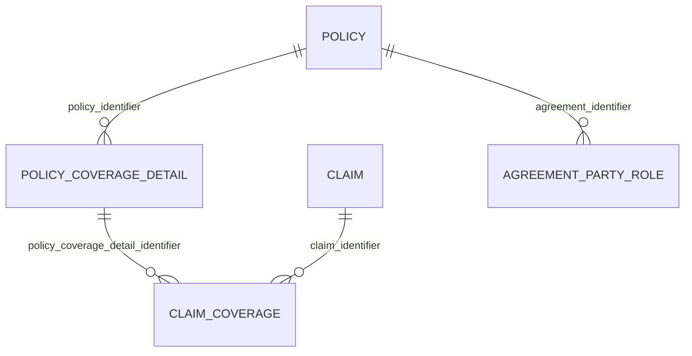
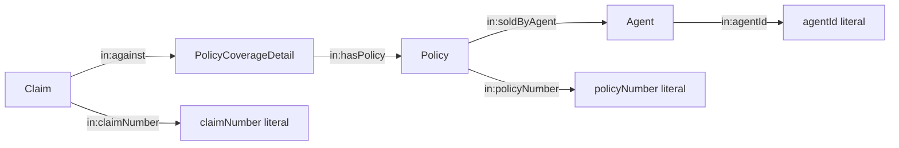
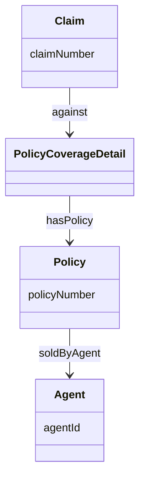
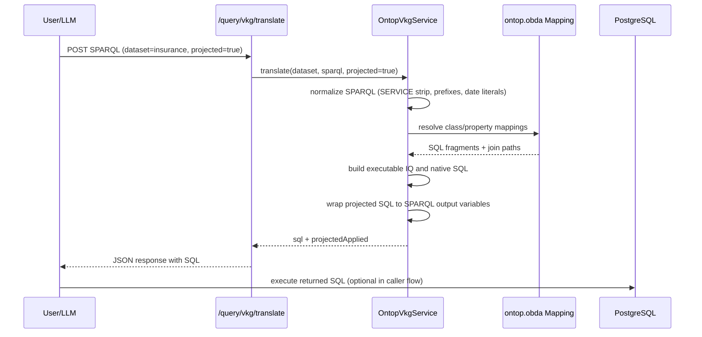

# SPARQL2SQL Knowledge Transfer for SQL Engineers

Date: 2026-04-10  
Audience: Engineers strong in SQL, new to SPARQL/ontology mappings  
Scope: `insurance` dataset (`core.ttl`, `bindings.ttl`, `ontop.obda`)

## 1. Mental Model

Think in 3 layers:

1. SQL layer: tables/columns/joins in Postgres (`acme_insurance.*`)
2. Ontology layer: business vocabulary (`in:Policy`, `in:claimNumber`, `in:against`)
3. Mapping layer: bridge between them (`ontop.obda`, optionally `bindings.ttl`)

SPARQL queries are written in layer 2.  
Ontop reads layer 3 and rewrites SPARQL to SQL over layer 1.

The most important rule for SQL engineers:

- ontology classes are semantic entity types, not guarantees of one-table-per-class
- ontology properties are semantic fields/relationships, not guarantees of one-column-per-property
- one class may come from a table, a filtered subset of a table, or a join
- one relationship may come from a direct FK or a multi-table join path

If you remember only one thing, remember this:

- SQL is the physical storage model
- ontology is the business meaning model
- `.obda` is the translation contract between them

## 1.1 Concrete SQL Example (Mini Schema)

Use this minimal subset to build intuition:

```sql
CREATE TABLE acme_insurance.policy (
  policy_identifier bigint primary key,
  policy_number text not null,
  effective_date timestamp,
  expiration_date timestamp
);

CREATE TABLE acme_insurance.policy_coverage_detail (
  policy_coverage_detail_identifier bigint primary key,
  policy_identifier bigint not null references acme_insurance.policy(policy_identifier)
);

CREATE TABLE acme_insurance.claim (
  claim_identifier bigint primary key,
  company_claim_number text not null,
  claim_open_date timestamp,
  claim_close_date timestamp
);

CREATE TABLE acme_insurance.claim_coverage (
  claim_identifier bigint not null references acme_insurance.claim(claim_identifier),
  policy_coverage_detail_identifier bigint not null references acme_insurance.policy_coverage_detail(policy_coverage_detail_identifier)
);

CREATE TABLE acme_insurance.agreement_party_role (
  agreement_identifier bigint not null,  -- links to policy_identifier
  party_identifier bigint not null,
  party_role_code text not null          -- 'AG' agent, 'PH' policy holder
);
```

Sample rows (to make joins concrete):

```text
policy
  policy_identifier=1001, policy_number='POL-001'

policy_coverage_detail
  policy_coverage_detail_identifier=5001, policy_identifier=1001

claim
  claim_identifier=9001, company_claim_number='CLM-001'

claim_coverage
  claim_identifier=9001, policy_coverage_detail_identifier=5001

agreement_party_role
  agreement_identifier=1001, party_identifier=2001, party_role_code='AG'
  agreement_identifier=1001, party_identifier=3001, party_role_code='PH'
```

## 1.2 Table Diagram (SQL View)



Note:

- This ER view is table-level (join structure), not a literal row dump.
- Row-level examples are shown in section 1.1 above.

## 1.3 Ontology + SPARQL View of the Same Data

Ontology terms (simplified):

```ttl
in:Policy rdf:type owl:Class .
in:PolicyCoverageDetail rdf:type owl:Class .
in:Claim rdf:type owl:Class .
in:Agent rdf:type owl:Class .

in:hasPolicy rdf:type owl:ObjectProperty ; rdfs:domain in:PolicyCoverageDetail ; rdfs:range in:Policy .
in:against rdf:type owl:ObjectProperty ; rdfs:domain in:Claim ; rdfs:range in:PolicyCoverageDetail .
in:soldByAgent rdf:type owl:ObjectProperty ; rdfs:domain in:Policy ; rdfs:range in:Agent .
in:policyNumber rdf:type owl:DatatypeProperty ; rdfs:domain in:Policy .
in:claimNumber rdf:type owl:DatatypeProperty ; rdfs:domain in:Claim .
in:agentId rdf:type owl:DatatypeProperty ; rdfs:domain in:Agent .
```

Important mapping note:

- `in:Agent` is not a standalone SQL table in this mini schema.
- It is derived from `agreement_party_role` rows with `party_role_code = 'AG'`.
- `in:soldByAgent` comes from joining `policy.policy_identifier = agreement_party_role.agreement_identifier` filtered to `'AG'`.

Graph diagram (business view):



Accuracy note:

- This diagram is accurate at the ontology/business layer for the simplified example.
- It is not a physical SQL lineage diagram.
- It intentionally hides implementation details such as:
- `Agent` being derived from `agreement_party_role` with `party_role_code = 'AG'`
- `Claim -> PolicyCoverageDetail` being implemented through the join table `claim_coverage`

Equivalent SPARQL shape:

```sparql
PREFIX in: <http://data.world/schema/insurance/>
SELECT ?agentId ?policyNumber ?claimNumber
WHERE {
  ?claim a in:Claim ;
         in:claimNumber ?claimNumber ;
         in:against ?pcd .
  ?pcd in:hasPolicy ?policy .
  ?policy in:policyNumber ?policyNumber ;
          in:soldByAgent ?agent .
  ?agent in:agentId ?agentId .
}
```

Read this as: same join logic as SQL, but expressed as graph edges.

## 1.4 Worked Join/Aggregation/Filter Examples (SQL vs SPARQL)

### Example A: 2-table join + filter

Business question: claims with their policy number, only closed claims in 2019.

SQL:

```sql
SELECT p.policy_number, c.company_claim_number
FROM acme_insurance.claim c
JOIN acme_insurance.claim_coverage cc
  ON cc.claim_identifier = c.claim_identifier
JOIN acme_insurance.policy_coverage_detail pcd
  ON pcd.policy_coverage_detail_identifier = cc.policy_coverage_detail_identifier
JOIN acme_insurance.policy p
  ON p.policy_identifier = pcd.policy_identifier
WHERE EXTRACT(YEAR FROM c.claim_close_date) = 2019;
```

SPARQL:

```sparql
PREFIX in: <http://data.world/schema/insurance/>
SELECT ?policyNumber ?claimNumber
WHERE {
  ?claim a in:Claim ;
         in:claimNumber ?claimNumber ;
         in:claimCloseDate ?closeDate ;
         in:against ?pcd .
  ?pcd in:hasPolicy ?policy .
  ?policy in:policyNumber ?policyNumber .
  FILTER(YEAR(?closeDate) = 2019)
}
```

How graph edges map to SQL joins:

- `?claim in:against ?pcd` -> `claim_coverage + policy_coverage_detail` join path
- `?pcd in:hasPolicy ?policy` -> `policy_coverage_detail.policy_identifier = policy.policy_identifier`
- filter on `?closeDate` -> `WHERE EXTRACT(YEAR FROM claim_close_date)=2019`

### Example B: join + aggregation + filter

Business question: total loss per policy for claims opened after 2018-12-31.

SQL (conceptual):

```sql
SELECT p.policy_number,
       SUM(ca.claim_amount) AS total_loss
FROM acme_insurance.claim c
JOIN acme_insurance.claim_coverage cc
  ON cc.claim_identifier = c.claim_identifier
JOIN acme_insurance.policy_coverage_detail pcd
  ON pcd.policy_coverage_detail_identifier = cc.policy_coverage_detail_identifier
JOIN acme_insurance.policy p
  ON p.policy_identifier = pcd.policy_identifier
JOIN acme_insurance.loss_payment lp
  ON lp.claim_amount_identifier IN (
    SELECT claim_amount_identifier
    FROM acme_insurance.claim_amount ca2
    WHERE ca2.claim_identifier = c.claim_identifier
  )
JOIN acme_insurance.claim_amount ca
  ON ca.claim_amount_identifier = lp.claim_amount_identifier
WHERE c.claim_open_date > TIMESTAMP '2018-12-31 00:00:00'
GROUP BY p.policy_number;
```

SPARQL:

```sparql
PREFIX in: <http://data.world/schema/insurance/>
PREFIX xsd: <http://www.w3.org/2001/XMLSchema#>
SELECT ?policyNumber (SUM(?lossPaymentAmount) AS ?totalLoss)
WHERE {
  ?claim a in:Claim ;
         in:claimOpenDate ?openDate ;
         in:against ?pcd ;
         in:hasLossPayment ?lp .
  ?lp in:lossPaymentAmount ?lossPaymentAmount .
  ?pcd in:hasPolicy ?policy .
  ?policy in:policyNumber ?policyNumber .
  FILTER(?openDate > "2018-12-31T00:00:00"^^xsd:dateTime)
}
GROUP BY ?policyNumber
```

How translation thinks:

- graph traversal defines join path
- `FILTER` becomes SQL `WHERE`
- `SUM` + `GROUP BY` map to SQL aggregate and grouping
- mappings in `ontop.obda` tell Ontop which tables/columns implement each edge/property

## 2. “Class”, “Property”, and “Term” in Plain SQL Language

### 2.1 Class term

A class is like an entity/table concept.

Examples from ontology:

- `in:Policy`
- `in:Claim`
- `in:PolicyCoverageDetail`

SQL analogy:

- “Rows in `policy` become instances of class `in:Policy`.”

More precise rule:

- sometimes one class maps to one table
- sometimes one class maps to a filtered subset of a table
- sometimes one class maps to a join/query, not a base table

Examples in this project:

- `in:Policy` comes from table `policy`
- `in:Agent` comes from `agreement_party_role` filtered to `party_role_code = 'AG'`
- `in:PolicyHolder` comes from `agreement_party_role` filtered to `party_role_code = 'PH'`

This is why an ontology class should be read as:

- “a business entity we want users to query”

not as:

- “a table that must physically exist”

### 2.2 Datatype property term

A datatype property maps an entity to a scalar value (string/date/number).

Examples:

- `in:policyNumber`
- `in:claimCloseDate`
- `in:lossPaymentAmount`

SQL analogy:

- `policy.policy_number`
- `claim.claim_close_date`
- `claim_amount.claim_amount`

### 2.3 Object property term

An object property maps one entity to another entity (relationship/join edge).

Examples:

- `in:hasPolicy` (`PolicyCoverageDetail -> Policy`)
- `in:against` (`Claim -> PolicyCoverageDetail`)
- `in:soldByAgent` (`Policy -> Agent`)

SQL analogy:

- FK join path between two tables/entities.

## 3. How `core.ttl` Works

`core.ttl` defines vocabulary only.

Example (simplified):

```ttl
in:against rdf:type owl:ObjectProperty ;
  rdfs:domain in:Claim ;
  rdfs:range in:PolicyCoverageDetail .

in:claimNumber rdf:type owl:DatatypeProperty ;
  rdfs:domain in:Claim .

in:Claim rdf:type owl:Class .
```

Read this as:

- Claim has a relationship `against` to PolicyCoverageDetail.
- Claim has scalar field `claimNumber`.
- Claim is an entity class.

Important:

- `core.ttl` does not contain SQL.
- It defines the semantic contract SPARQL uses.

Practical translation rule:

- add a class in `core.ttl` when the business needs a queryable entity concept
- add a datatype property when the business needs a scalar attribute on that concept
- add an object property when the business needs a navigable relationship between two concepts

You do not ask:

- “what table name do I have?”

You ask:

- “what business thing should users be able to ask for?”
- “what attributes of that thing matter?”
- “what relationships between things matter?”

## 4. How `ontop.obda` Works (Runtime-Critical)

`ontop.obda` is the runtime translator configuration for `/query/vkg/translate`.

Each mapping has:

- `mappingId`: label only
- `target`: RDF triples to produce (class/property)
- `source`: SQL query that produces required columns

### 4.1 Example: class + datatype fields

From `ontology/insurance/ontop.obda`:

```obda
mappingId Policy
target    :Policy/{policy_identifier} a in:Policy ;
          in:policyNumber {policy_number}^^xsd:string ;
          in:policyEffectiveDate {effective_date}^^xsd:dateTime ;
          in:policyExpirationDate {expiration_date}^^xsd:dateTime .
source    SELECT policy_identifier, policy_number, effective_date, expiration_date
          FROM acme_insurance.policy
```

Read it as:

- For each row in `policy`, create subject IRI `:Policy/<id>`.
- Assert it is `a in:Policy`.
- Emit datatype properties from row columns.

### 4.2 Example: object relationship

```obda
mappingId PolicyCoverageDetail-hasPolicy
target    :PolicyCoverageDetail/{pcd_id} in:hasPolicy :Policy/{pid} .
source    SELECT policy_coverage_detail_identifier AS pcd_id,
                 policy_identifier AS pid
          FROM acme_insurance.policy_coverage_detail
```

Read it as:

- Create edge `PolicyCoverageDetail -> Policy` using IDs from SQL result.

### 4.3 Example: a class derived from a filtered subset, not a table

From `ontology/insurance/ontop.obda`:

```obda
mappingId Agent
target    :Agent/{agent_id} a in:Agent ;
          in:agentId {agent_id}^^xsd:string .
source    SELECT CAST(party_identifier AS VARCHAR) AS agent_id,
                 agreement_identifier AS policy_identifier
          FROM acme_insurance.agreement_party_role
          WHERE party_role_code = 'AG'
```

Read it as:

- there is no physical table named `agent`
- the business concept `Agent` is represented by rows in `agreement_party_role`
- only rows with `party_role_code = 'AG'` are considered agents

This is the exact reason `Agent` is a class in the ontology even though it is not a base table in SQL.

### 4.4 Why this drives SPARQL→SQL

If SPARQL asks:

```sparql
SELECT ?pnum
WHERE {
  ?p a in:Policy ;
     in:policyNumber ?pnum .
}
```

Ontop can rewrite to SQL because it finds:

- class mapping for `in:Policy`
- data property mapping for `in:policyNumber`

If mapping is missing in `.obda`, translation cannot produce correct SQL.

## 4.5 Class/Property Diagram (Semantic Contract)



## 5. How `bindings.ttl` Works

`bindings.ttl` is R2RML-style semantic binding documentation/graph.

It uses terms like:

- `rr:TriplesMap`
- `rr:logicalTable`
- `rr:subjectMap`
- `rr:predicateObjectMap`
- `rr:column`, `rr:datatype`, `rr:template`

Example structure:

```ttl
<#Policy> a rr:TriplesMap ;
  rr:logicalTable [ rr:sqlQuery "SELECT ... FROM {schema}.policy" ] ;
  rr:subjectMap [ rr:template "{schema}/Policy-{policy_identifier}" ; rr:class in:Policy ] ;
  rr:predicateObjectMap [
    rr:predicate in:policyNumber ;
    rr:objectMap [ rr:column "policy_number" ; rr:datatype xsd:string ]
  ] .
```

Read it as:

- Same idea as OBDA mapping, expressed in R2RML vocabulary.

Project-specific annotations in `bindings.ttl`:

- `ex:joinKey`: human-readable join key hint
- `ex:queryExample`: SQL examples tied to a mapping
- `rdfs:comment`: business + join-path explanation

Current implementation note:

- Endpoint translation uses `ontop.obda` at runtime.
- `bindings.ttl` is still useful for documentation and governance.

## 5.2 How to Think About SQL -> Ontology Translation

Use this decision flow when converting relational schema into ontology + mapping.

1. Start from business questions
- Example: “Which agent sold this policy?”
- That suggests a business concept `Agent` and a relationship `soldByAgent`.

2. Find physical storage pattern in SQL
- In this schema, agents are not stored in a dedicated table.
- They are stored in `agreement_party_role` with `party_role_code = 'AG'`.

3. Define semantic concepts in ontology
- `in:Agent` class
- `in:agentId` datatype property
- `in:soldByAgent` object property

4. Define runtime mapping in `.obda`
- filtered SQL query for the class
- join SQL query for the relationship

5. Validate with SPARQL, not just SQL
- if a SPARQL user can ask the business question naturally, the model is probably shaped correctly

## 5.3 Side-by-Side: Physical SQL vs Semantic Ontology

Physical SQL view:

```text
agreement_party_role
  agreement_identifier
  party_identifier
  party_role_code

Meaning:
  if party_role_code = 'AG' -> this row represents an agent role on a policy
  if party_role_code = 'PH' -> this row represents a policy holder role on a policy
```

Semantic ontology view:

```text
Policy -- soldByAgent --> Agent
Policy -- hasPolicyHolder --> PolicyHolder
Agent -- agentId --> "2001"
PolicyHolder -- policyHolderId --> "3001"
```

Translation contract in `.obda`:

```obda
mappingId Policy-soldByAgent
target    :Policy/{pid} in:soldByAgent :Agent/{agent_id} .
source    SELECT p.policy_identifier AS pid,
                 CAST(apr.party_identifier AS VARCHAR) AS agent_id
          FROM acme_insurance.policy p
          JOIN acme_insurance.agreement_party_role apr
            ON apr.agreement_identifier = p.policy_identifier
          WHERE apr.party_role_code = 'AG'
```

This is the pattern to teach new contributors:

- physical SQL model may encode multiple business concepts in one table
- ontology splits them into clearer semantic classes and relationships
- `.obda` restores the connection between those two views

## 5.1 `bindings.ttl` vs `ontop.obda` (When to Use Which)

- `ontop.obda`: runtime mapping consumed by Ontop for actual translation.
- `bindings.ttl`: semantic/r2rml representation for documentation, introspection, and query examples.

If they diverge, runtime behavior follows `ontop.obda`.

## 6. SQL-to-Ontology Mapping Cookbook

### 6.1 Add a new table `vehicle`

Suppose SQL:

```sql
CREATE TABLE acme_insurance.vehicle (
  vehicle_id bigint primary key,
  policy_identifier bigint not null,
  vin text not null,
  model_year int
);
```

Step A: add ontology terms in `core.ttl`

```ttl
in:Vehicle rdf:type owl:Class .

in:vin rdf:type owl:DatatypeProperty ;
  rdfs:domain in:Vehicle .

in:modelYear rdf:type owl:DatatypeProperty ;
  rdfs:domain in:Vehicle .

in:hasVehicle rdf:type owl:ObjectProperty ;
  rdfs:domain in:Policy ;
  rdfs:range in:Vehicle .
```

Step B: add OBDA mappings

```obda
mappingId Vehicle
target    :Vehicle/{vehicle_id} a in:Vehicle ;
          in:vin {vin}^^xsd:string ;
          in:modelYear {model_year}^^xsd:integer .
source    SELECT vehicle_id, vin, model_year
          FROM acme_insurance.vehicle

mappingId Policy-hasVehicle
target    :Policy/{policy_identifier} in:hasVehicle :Vehicle/{vehicle_id} .
source    SELECT policy_identifier, vehicle_id
          FROM acme_insurance.vehicle
```

Step C: optional `bindings.ttl` TriplesMap update for documentation parity.

### 6.1.1 Checklist: when should a SQL structure become a class?

Create a class when:

- users need to refer to it as a thing in queries
- it has its own identity
- it has attributes or relationships worth querying

Do not require a dedicated table first.

A class may come from:

- one base table
- a filtered subset of a table
- a join/view-like query

Examples:

- `Policy` -> base table
- `Agent` -> filtered subset of `agreement_party_role`
- `PolicyHolder` -> filtered subset of `agreement_party_role`

### 6.2 Add a new column `policy.status_reason`

If semantic term exists:

- only update OBDA target/source if needed.

If new semantic term needed:

1. Add property in `core.ttl`:

```ttl
in:policyStatusReason rdf:type owl:DatatypeProperty ;
  rdfs:domain in:Policy .
```

2. Update `Policy` mapping in `ontop.obda`:

```obda
target ... ; in:policyStatusReason {status_reason}^^xsd:string .
source SELECT ..., status_reason FROM acme_insurance.policy
```

## 7. How to Validate Changes

1. Restart backend (Ontop mapping loaded at startup).
2. Call endpoint:

```bash
curl -sS -X POST \
  'http://localhost:8080/query/vkg/translate?dataset=insurance&projected=true' \
  -H 'Content-Type: application/sparql-query' \
  --data-binary @query.sparql
```

3. Run benchmark:

```bash
cd services/backend
mvn test -Dtest=OntopBenchmarkTest -Dgroups=integration
```

4. Compare endpoint SQL to benchmark CSV:

```bash
scripts/compare_vkg_translate_vs_csv.sh
```

## 8. Sequence Diagram: How Translation Works



## 9. Why SPARQL→SQL Is Powerful (for SQL Teams)

1. Stable query interface
- Applications prompt/query business terms (`Policy`, `Claim`, `Agent`) instead of physical schema names.
- SQL schema can evolve while SPARQL contract stays stable if mappings are updated.

2. Better semantic portability
- One ontology vocabulary can map to different physical schemas/environments.

3. Safer LLM query generation
- LLM can target domain terms rather than brittle table/column names.
- Mapping layer absorbs physical-model complexity.

4. Governance
- Explicit, reviewable mapping artifacts (`core.ttl`, `ontop.obda`, `bindings.ttl`) clarify intent.

5. Better abstraction over overloaded SQL tables
- A single physical table can represent several business concepts.
- The ontology lets you expose those concepts cleanly without changing storage design.

## 10. Common Failure Patterns

1. SPARQL term exists in `core.ttl` but missing in `.obda`
- Symptom: wrong/empty SQL or failed translation.

2. Table/column renamed in SQL but `.obda` not updated
- Symptom: SQL execution error from generated SQL.

3. Relationship exists in SQL but no object-property mapping
- Symptom: SPARQL joins return incomplete or zero results.

4. Unsupported SPARQL function in Ontop
- Example: `date_diff` benchmark case.

5. Assuming every class must be a table
- Symptom: ontology becomes too physical and mirrors SQL quirks instead of business meaning.
- Better approach: model the business concept first, then map it from the appropriate SQL subset/join.

## 11. Short Glossary

- IRI: global identifier for class/property/instance.
- Triple: `(subject, predicate, object)` fact.
- `a`: shorthand for `rdf:type` (“is a class instance”).
- TriplesMap: one mapping unit from SQL rows to RDF triples.
- Projection: selected SPARQL variables in `SELECT`.
